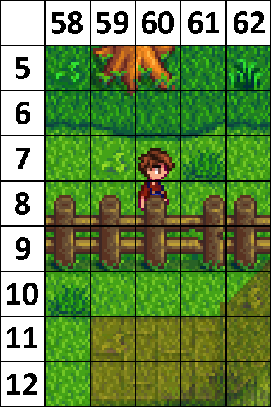

# Les type de calques
Dans TILED, il existe **2 types** de calques utilisés pour définir les **5 calques principaux** du jeu.

- Les types de calques sont : les **calque d'object** et les **calque de Tuiles.**
- Les principaux types de calques sont : le **`Back`**, le **`Buildings`**, le **`Paths`**, le **`Front`** et le **`AlwaysFront`**.

## Les calques `Back` et `Paths` :
`Back` et `Paths` sont tout deux des calques d'arrière-plan à la différence que les éléments dans `Paths` peuvent être retirés par le joueur.

- `Back` est donc généralement utilisé pour créer le décor sur lequel marchera le joueur.
- `Paths` lui est donc généralement utilisé pour disposer des éléments collectable par le joueur.

## Les calques `Front` et `AlwaysFront` :
`Front` et `AlwaysFront` sont tout deux des calques d'avant-plan à la différence que les éléments dans `AlwaysFront` seront toujours au-dessus du joueur le cachant ainsi en dessous.

- `Front` est donc généralement utilisé pour des décors qui possèdent de la profondeurs, mais où l'on souhaite voir le jour derrière.
- `AlwaysFront` lui est donc généralement utilisé pour des décors qui doivent toujours être devant le joueur.

# Le calque `Buildings` :
Ce dernier est utilisé afin de créer des murs dans le jeu. Cela peut aussi bien **représenter une table qu'une montagne.**

## Exemple :
|Illustration|Explication|
|------------|-----------|
||Sur cette illustration, on peut voir un exemple de Tuiles défini sur les calques `Back`, `Buildings`, `Front` et `AlwaysFront`.  Ici, les tuiles de la **ligne 10** ne sont que décoratif ; ils sont donc définis sur le calque `Back`.  Les tuiles de la **ligne 9** eux ne sont pas traversables ; ils font donc partie du calque `Buildings`.  Les tuiles aux **coordonnées de [11;59] à [12;62]** eux deviennes transparente si le joueur passe derrière ; ils font donc partie du calque `Front`.  Enfin, les tuiles de la **ligne 8** eux sont toujours visibles même quand le joueur passe derrière ; ils font donc partie du calque `AlwaysFront`.|
